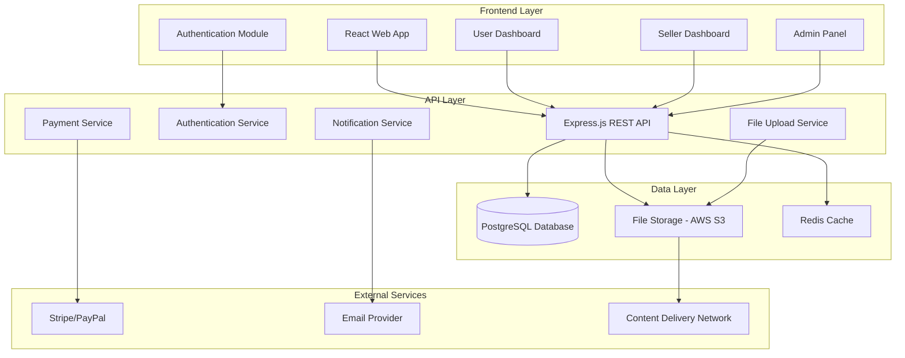
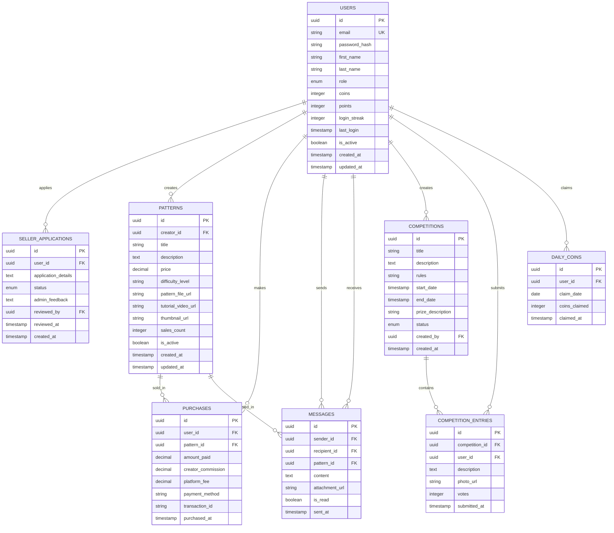

# Design Document

## Overview

The Crochet Community Platform is a full-stack web application built with a modern three-tier architecture: a React frontend with warm pink/white branding, a Node.js/Express API backend, and a PostgreSQL database. The platform integrates real-time features, file storage for patterns and videos, payment processing, and comprehensive admin tools. The system supports role-based access control with distinct interfaces for regular users, creators, and administrators.

## Architecture

### System Architecture



### Database Schema Design



## Components and Interfaces

### Frontend Components

#### Core Layout Components
- **AppLayout**: Main application wrapper with navigation and branding
- **LoadingAnimation**: Playful loading screen with pink/white theme
- **Navigation**: Role-based navigation menu (User/Creator/Admin views)
- **Footer**: Platform information and links

#### User Interface Components
- **PatternMarketplace**: Browse and search patterns with filtering
- **PatternDetail**: Individual pattern view with purchase options
- **UserDashboard**: Personal profile, purchased patterns, coins/points
- **DailyCoinCalendar**: Interactive calendar for daily coin claiming
- **MessagingInterface**: Direct messaging with creators
- **CompetitionHub**: View and participate in competitions

#### Creator Interface Components
- **SellerDashboard**: Comprehensive creator business management
- **PatternUpload**: Multi-step pattern and tutorial upload wizard
- **SalesAnalytics**: Revenue tracking and pattern performance metrics
- **CreatorMessaging**: Manage conversations with pattern buyers
- **InventoryManagement**: Pattern catalog management tools

#### Admin Interface Components
- **AdminDashboard**: Platform overview with key metrics
- **UserManagement**: User account administration
- **SellerApprovalWorkflow**: Review and approve seller applications
- **ContentModeration**: Pattern and competition content review
- **PlatformAnalytics**: Revenue, engagement, and growth metrics
- **CompetitionManagement**: Create and manage platform competitions

### API Endpoints Design

#### Authentication & User Management
```
POST /api/auth/register
POST /api/auth/login
POST /api/auth/logout
GET /api/auth/profile
PUT /api/auth/profile
POST /api/auth/forgot-password
POST /api/auth/reset-password
```

#### Pattern Management
```
GET /api/patterns
GET /api/patterns/:id
POST /api/patterns (Creator only)
PUT /api/patterns/:id (Creator only)
DELETE /api/patterns/:id (Creator only)
POST /api/patterns/:id/purchase
GET /api/patterns/my-purchases
```

#### Seller Operations
```
POST /api/seller/apply
GET /api/seller/dashboard
GET /api/seller/analytics
GET /api/seller/patterns
PUT /api/seller/patterns/:id
```

#### Messaging System
```
GET /api/messages
GET /api/messages/conversations
POST /api/messages
PUT /api/messages/:id/read
GET /api/messages/pattern/:patternId
```

#### Gamification
```
GET /api/coins/balance
POST /api/coins/claim-daily
GET /api/coins/history
GET /api/points/balance
GET /api/points/history
```

#### Competitions
```
GET /api/competitions
GET /api/competitions/:id
POST /api/competitions/:id/enter
GET /api/competitions/:id/entries
POST /api/competitions/:id/vote
```

#### Admin Operations
```
GET /api/admin/dashboard
GET /api/admin/users
PUT /api/admin/users/:id/status
GET /api/admin/seller-applications
PUT /api/admin/seller-applications/:id/approve
PUT /api/admin/seller-applications/:id/reject
GET /api/admin/analytics
POST /api/admin/competitions
```

## Data Models

### User Model
```typescript
interface User {
  id: string;
  email: string;
  firstName: string;
  lastName: string;
  role: 'user' | 'creator' | 'admin';
  coins: number;
  points: number;
  loginStreak: number;
  lastLogin: Date;
  isActive: boolean;
  createdAt: Date;
  updatedAt: Date;
}
```

### Pattern Model
```typescript
interface Pattern {
  id: string;
  creatorId: string;
  title: string;
  description: string;
  price: number;
  difficultyLevel: 'beginner' | 'intermediate' | 'advanced';
  patternFileUrl: string;
  tutorialVideoUrl: string;
  thumbnailUrl: string;
  salesCount: number;
  isActive: boolean;
  createdAt: Date;
  updatedAt: Date;
}
```

### Seller Application Model
```typescript
interface SellerApplication {
  id: string;
  userId: string;
  applicationDetails: string;
  status: 'pending' | 'approved' | 'rejected';
  adminFeedback?: string;
  reviewedBy?: string;
  reviewedAt?: Date;
  createdAt: Date;
}
```

## Error Handling

### Frontend Error Handling
- **Global Error Boundary**: Catch and display user-friendly error messages
- **API Error Interceptor**: Handle authentication errors and network issues
- **Form Validation**: Real-time validation with clear error messaging
- **Loading States**: Prevent user actions during API calls
- **Retry Mechanisms**: Automatic retry for failed requests with exponential backoff

### Backend Error Handling
- **Centralized Error Middleware**: Consistent error response formatting
- **Input Validation**: Comprehensive request validation using Joi or similar
- **Database Error Handling**: Graceful handling of constraint violations and connection issues
- **File Upload Errors**: Proper handling of file size, type, and upload failures
- **Payment Processing Errors**: Secure handling of payment gateway failures
- **Rate Limiting**: Prevent abuse with request rate limiting

### Error Response Format
```typescript
interface ErrorResponse {
  success: false;
  error: {
    code: string;
    message: string;
    details?: any;
  };
  timestamp: string;
}
```

## Testing Strategy

### Frontend Testing
- **Unit Tests**: Component testing with React Testing Library
- **Integration Tests**: User flow testing with Cypress
- **Visual Regression Tests**: Screenshot comparison for UI consistency
- **Accessibility Tests**: WCAG compliance testing
- **Performance Tests**: Core Web Vitals monitoring

### Backend Testing
- **Unit Tests**: Service and utility function testing with Jest
- **Integration Tests**: API endpoint testing with Supertest
- **Database Tests**: Repository pattern testing with test database
- **Authentication Tests**: JWT and session management testing
- **File Upload Tests**: Mock file upload and storage testing

### End-to-End Testing
- **User Journey Tests**: Complete user workflows from registration to purchase
- **Creator Workflow Tests**: Pattern upload and sales process testing
- **Admin Workflow Tests**: Approval processes and platform management
- **Payment Integration Tests**: Mock payment processing flows
- **Cross-browser Testing**: Compatibility across major browsers

### Performance Testing
- **Load Testing**: API performance under concurrent users
- **Database Performance**: Query optimization and indexing validation
- **File Storage Performance**: Upload and download speed testing
- **CDN Performance**: Content delivery optimization validation

## Security Considerations

### Authentication & Authorization
- **JWT Token Management**: Secure token generation and validation
- **Role-Based Access Control**: Granular permissions for different user types
- **Password Security**: Bcrypt hashing with salt rounds
- **Session Management**: Secure session handling and timeout policies

### Data Protection
- **Input Sanitization**: Prevent XSS and injection attacks
- **SQL Injection Prevention**: Parameterized queries and ORM usage
- **File Upload Security**: Virus scanning and file type validation
- **HTTPS Enforcement**: SSL/TLS encryption for all communications
- **CORS Configuration**: Proper cross-origin resource sharing setup

### Payment Security
- **PCI Compliance**: Secure payment processing through certified gateways
- **Tokenization**: No storage of sensitive payment information
- **Fraud Detection**: Integration with payment provider fraud tools
- **Transaction Logging**: Comprehensive audit trails for financial operations